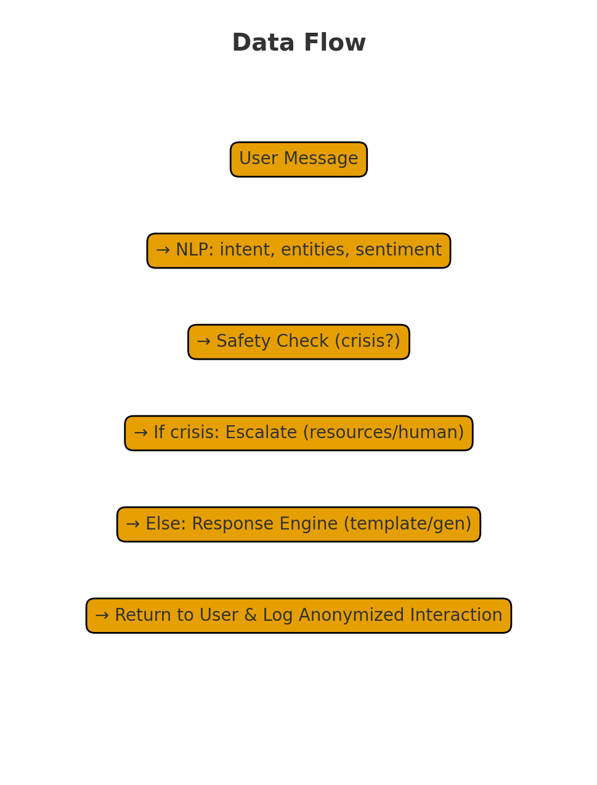

# 🌿 Mental Health Agent System — Capstone Project by Team Dynamo

A creative, smart, and extensible system designed to offer personalized mental‑health assistance using modern AI techniques.

---

## 🧠 Problem Statement  
Mental health support is often hard to access due to  
- Limited availability of professionals  
- High cost barriers  
- Social stigma  
- Lack of personalized care  

This project solves the above by building an **AI‑powered conversational agent** that provides supportive interactions and guides users through exercises, journaling, and emotional regulation techniques.

---

## 🚀 Solution Overview  
The system uses:  
- **Natural Language Processing (NLP)** to understand user inputs  
- **Emotion classification models** to detect tone and mood  
- **Knowledge‑based suggestions** for coping strategies  
- **Memory‑based context handling** to enable longer, meaningful conversations  

It is modular, scalable, and built to be deployable as:  
- A web app  
- A mobile app  
- An API backend

---

## 🏗️ System Architecture  


### 🔧 Components  
1. **Frontend UI** — Chatbox, user interface, progress tracking  
2. **Backend API** — Handles conversations, model serving  
3. **ML Models** — Emotion classifier + intent recognizer  
4. **Database** — Stores user context, conversation history  
5. **Recommendation Engine** — Generates dynamic support messages  

---

## 🔄 Dataflow Diagram  


---

## 🛠️ Setup Instructions  

### 1️⃣ Clone the Repository  
```bash
git clone <your_repo_url>
cd mental-health-agent
```

### 2️⃣ Create a Virtual Environment  
```bash
python -m venv env
source env/bin/activate  # Windows: env\Scripts\activate
```

### 3️⃣ Install Dependencies  
```bash
pip install -r requirements.txt
## 🚀 Installation

### Prerequisites
- Python 3.8 or higher
- pip package manager

### Step-by-Step Setup

1. **Clone the repository**:
   ```bash
   git clone https://github.com/chandradityadebnath/mental-health-agent-capstone-project.git
   cd mental-health-agent-capstone-project
```

### 4️⃣ Run basic example
```bash
cd examples
python basic_usage.py
```

---

## 📁 Repository Structure  
```
mental-health-agent/
├── 📄 README.md                    # Main project documentation
├── 📄 requirements.txt             # Dependencies
├── 📄 LICENSE                      # MIT License
├── 📄 .gitignore                   # Git ignore file
├── 📁 src/                         # Source code
│   ├── __init__.py
│   ├── agents/                     # Multi-agent system
│   │   ├── __init__.py
│   │   ├── crisis_detector.py
│   │   ├── emotion_analyzer.py
│   │   ├── support_planner.py
│   │   └── resource_matcher.py
│   ├── tools/                      # Custom tools
│   │   ├── __init__.py
│   │   ├── mental_health_tools.py
│   │   └── safety_validator.py
│   ├── memory/                     # Session & memory management
│   │   ├── __init__.py
│   │   ├── session_manager.py
│   │   └── long_term_memory.py
│   └── utils/                      # Utilities
│       ├── __init__.py
│       ├── config.py
│       └── helpers.py
├── 📁 notebooks/                   # Jupyter notebooks
│   └── mental-health-agent-system-capstone-project.ipynb
├── 📁 tests/                       # Test suite
│   ├── __init__.py
│   ├── test_agents.py
│   ├── test_tools.py
│   └── test_integration.py
├── 📁 docs/                        # Documentation
│   ├── architecture.md
│   ├── api.md
│   └── deployment.md
├── 📁 examples/                    # Usage examples
│   ├── basic_usage.py
│   └── advanced_features.py
├── 📁 data/                        # Sample data (if any)
│   └── sample_resources.json
├── 📄 .github/workflows/ci.yml     # CI/CD pipeline
└── 📄 setup.py                     # Package setup
```

---

## ✨ Features  
- 🌈 Emotion Analysis  
- 🧩 Smart Intent Recognition  
- 📝 Personalized Recommendations  
- 💬 Context-aware Dialogue  
- 🔒 User Privacy Focus  

---

## 📌 Future Enhancements  
- Mobile app integration  
- Multi‑language support  
- Real‑time sentiment graphs  
- Voice‑based interface  

---

## 🎨 Creative Note  
This project is built to blend **technology + empathy**, helping people feel heard and supported.  
Let your innovations brighten someone’s day. ✨  

