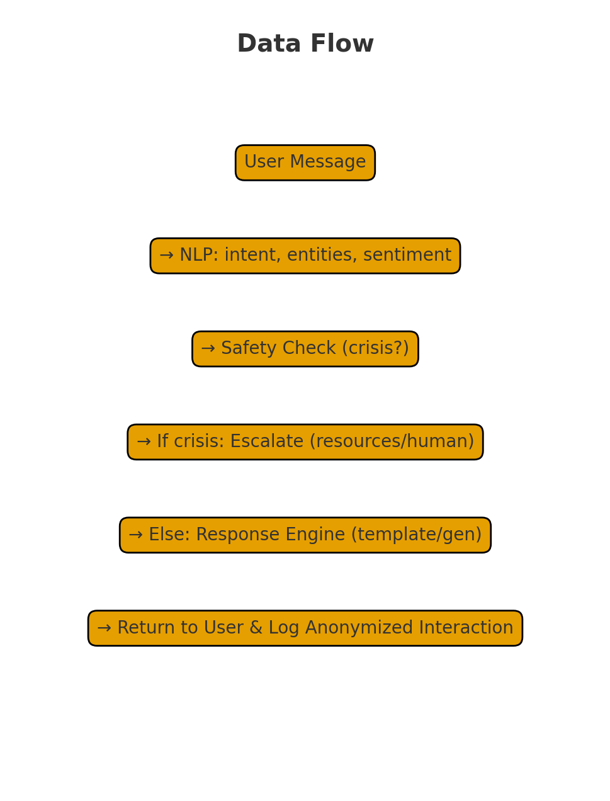

# 🌿 MindMate - Mental Health Agent System — Capstone Project 

"Because everyone deserves a listening ear 🤗 and support system"

## A multi-agent AI project built by Chandraditya Debnath, Aditya Kukade, Chaitanya Mutte, and Mithesh Makam.

A creative, smart, and extensible system designed to offer personalized mental‑health assistance using modern AI techniques 

## 🚀 Live Demo

Experience the live Mental Health Agent System:

🔗 **Live Streamlit App:** [https://mindmate-mental-health-capstone-project-mqyasujqfqzkq9p9wgmnwd.streamlit.app/](https://mindmate-mental-health-capstone-project-mqyasujqfqzkq9p9wgmnwd.streamlit.app/)

[](https://mindmate-mental-health-capstone-project-mqyasujqfqzkq9p9wgmnwd.streamlit.app/)

###  Try It Now!
- **Real-time AI-powered mental health support**
- **Multi-agent system with 4 specialized agents**
- **Crisis detection and emergency protocols**
- **Emotional analysis and personalized responses**

---

##  Problem Statement  :
Mental health support is often hard to access due to  
- Limited availability of professionals  
- High cost barriers  
- Social stigma  
- Lack of personalized care  

This project solves the above by building an **AI‑powered conversational agent** that provides supportive interactions and guides users through exercises, journaling, and emotional regulation techniques.

---

## Solution Overview  
The system uses:  
- **Natural Language Processing (NLP)** to understand user inputs  
- **Emotion classification models** to detect tone and mood  
- **Knowledge‑based suggestions** for coping strategies  
- **Memory‑based context handling** to enable longer, meaningful conversations  

It is modular, scalable, and built to be deployable as:  
- A web app  
- A mobile app  
- An API backend

---

## System Architecture  


### 🔧 Components  
1. **Frontend UI** — Chatbox, user interface, progress tracking  
2. **Backend API** — Handles conversations, model serving  
3. **ML Models** — Emotion classifier + intent recognizer  
4. **Database** — Stores user context, conversation history  
5. **Recommendation Engine** — Generates dynamic support messages  

---

## 🔄 Dataflow Diagram  


---

## 🛠️ Setup Instructions  

### 1️⃣ Clone the Repository  
```bash
git clone <your_repo_url>
cd mental-health-agent
```

### 2️⃣ Create a Virtual Environment  
```bash
python -m venv env
source env/bin/activate  # Windows: env\Scripts\activate
```

### 3️⃣ Install Dependencies  
```bash
pip install -r requirements.txt
## 🚀 Installation

### Prerequisites
- Python 3.8 or higher
- pip package manager

### Step-by-Step Setup

1. **Clone the repository**:
   ```bash
   git clone https://github.com/chandradityadebnath/mental-health-agent-capstone-project.git
   cd mental-health-agent-capstone-project
```

### 4️⃣ Run basic example
```bash
cd examples
python basic_usage.py
```

---

## 📁 Repository Structure  
```
/mindmate-mental-health-capstone-project
|
|-- README.md                   <-- (CRITICAL) The main entry point. Your project summary, setup guide, and links.
|-- LICENSE                     <-- (REQUIRED) Specifies how others can use your code (e.g., MIT License).
|-- requirements.txt            <-- (CRITICAL) List of all Python dependencies for easy replication.
|-- .gitignore                  <-- (CRITICAL) Ignores environment files, secrets, and local checkpoints.
|
|-- /notebooks
|   |-- mindmate_capstone_project.ipynb <-- Your core Kaggle Notebook (Renamed for professional consistency).
|   |-- 01_data_prep.ipynb      <-- (Optional) If you have a separate file for data cleaning/preparation.
|
|-- /src                        <-- Source Code (for agents, tools, and main execution)
|   |-- __init__.py             <-- Makes 'src' a Python module.
|   |-- agents                  <-- Folder for individual agent classes
|   |   |-- emotional_agent.py
|   |   |-- crisis_agent.py
|   |   |-- orchestrator.py
|   |   |-- tools.py            <-- Contains custom functions the agents can use (e.g., memory, search).
|   |-- main.py                 <-- (Optional) A clean script to run the final Streamlit app logic.
|
|-- /data
|   |-- sample_data.csv         <-- A small, anonymized sample of the data used for training/testing (if applicable and non-sensitive).
|   |-- metrics_report.json     <-- (Optional) Output file for final performance metrics.
|
|-- /docs
|   |-- architecture_diagram.png <-- The image of your "Layered Support System" you requested earlier.
|   |-- system_design.md         <-- (Optional) Detailed write-up on agent architecture and memory system.
|
|-- /streamlit_app
|   |-- Home.py                 <-- The main Streamlit app file.
|   |-- pages/                  <-- Streamlit pages (e.g., a "Metrics" or "About" page).
```

---

## ✨ Features  
- 🌈 Emotion Analysis  
- 🧩 Smart Intent Recognition  
- 📝 Personalized Recommendations  
- 💬 Context-aware Dialogue  
- 🔒 User Privacy Focus  

---

## 📌 Future Enhancements  
- Mobile app integration  
- Multi‑language support  
- Real‑time sentiment graphs  
- Voice‑based interface  

---

## 🎨 Creative Note  
This project is built to blend **technology + empathy**, helping people feel heard and supported.  
Let your innovations brighten someone’s day. ✨  

